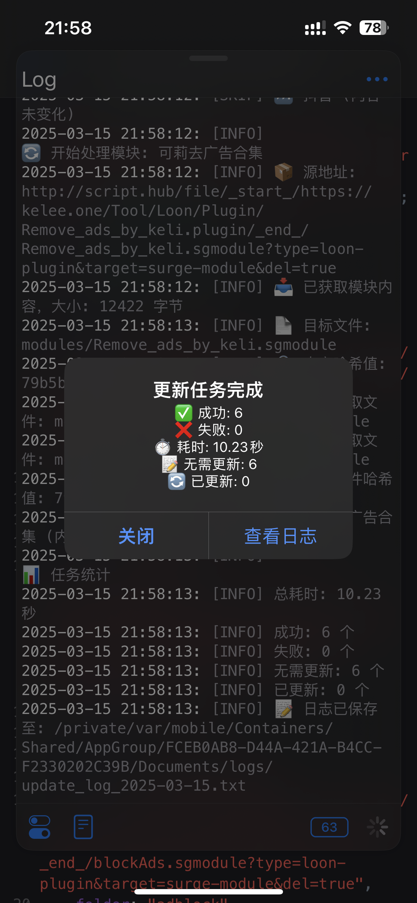

# Surge Tools


一个用于合并和管理 Surge 规则和模块的工具。A tool for merging and managing Surge rules and modules.

<details>
<summary>📱 Scriptables脚本效果图</summary>

</details>
## 📖 简介 Introduction

这个工具可以帮助你：
- 合并多个规则源
- 管理模块配置
- 自动化更新维护

有很多大规则，或单个app的去广告规则等，本工具帮助你只保留符合自己需求的规则。

## 🚀 快速开始 Quick Start

### 使用方法

1. 如果是 Surge 模块：
   - 直接搜索添加到配置文件中
   - 运行 actions 合并

2. 如果是 Loon 插件或 QX 脚本：
   - 使用 `surge-module-upload2.js` 添加到本地
   - 配合 Script-Hub 可以上传到自己的 GitHub 仓库
   - 可配合快捷指令定时更新

## ✨ 功能特点 Features

### 🔄 规则合并
- 支持多个规则源的合并
- 自动去重和排序
- 支持规则优先级配置
- 支持排除特定规则和规则集
- 自动生成规则统计信息

### 📦 模块合并
- 支持多个模块源的合并
- 自动合并 MITM hostname
- 支持排除特定段落和行
- 支持段落优先级配置
- 支持从模块提取规则
- 保持注释和格式

### ⚙️ 自动化
- GitHub Actions 自动更新
- 定时拉取最新规则和模块
- 自动生成更新时间戳
- 失败自动重试

### 🛠 配置灵活
- 支持 YAML 配置文件
- 可自定义输出目录
- 可配置规则类型优先级
- 可配置段落排序
- 详细的日志输出

## 📁 目录结构

```
surge-tools/
├── .github/
│   └── workflows/
│       └── update-rules.yml
├── rules/
├── modules/
├── config/
│   └── config.yaml
├── src/
│   └── main.py
└── README.md
```

## 🔧 工具说明

### surge-module-upload2.js（推荐）
- 用于批量上传模块到 GitHub
- 支持自定义文件夹
- 支持 sgmodule、rule 上传
- 只生成一个 commit 记录
- 修改自：
  - [SurgeModuleTool.js](https://raw.githubusercontent.com/Script-Hub-Org/Script-Hub/main/SurgeModuleTool.js)
  - [Script-Hub模块](https://raw.githubusercontent.com/Script-Hub-Org/Script-Hub/main/modules/script-hub.surge.sgmodule)

## 📱 Surge 相关资源

### 官方资源
- [Surge官网](https://nssurge.com/)
- [Surge社区1](https://t.me/SurgeCommunity)
- [Surge社区2](https://t.me/loveapps)

### 推荐配置
- [开发者推荐最小配置](https://raw.githubusercontent.com/Rabbit-Spec/Surge/Master/Conf/Spec/Surge-Developer.conf)
- [Lucky配置](https://raw.githubusercontent.com/As-Lucky/Lucky/main/Lucky-Surge.conf)
- [深巷有喵配置](https://raw.githubusercontent.com/Rabbit-Spec/Surge/Master/Conf/Spec/Surge-EN.conf)

### 模块资源
- [模块查找](https://surge.qingr.moe)
- [Yfamily教程](https://whatshub.top/)
- [Rabbit-Spec模块](https://github.com/Rabbit-Spec/Surge/tree/Master/Module)

### 必装模块
- [BoxJs](https://github.com/chavyleung/scripts/raw/master/box/rewrite/boxjs.rewrite.surge.sgmodule)
- [ScriptHub](https://raw.githubusercontent.com/Script-Hub-Org/Script-Hub/main/modules/script-hub.surge.sgmodule)
- [SubStore](https://raw.githubusercontent.com/sub-store-org/Sub-Store/master/config/Surge-Beta.sgmodule)
- [模块使用教程](https://mylucky.cyou/post/20240107003508.html)
- [可莉插件网站surge适配版模块@baby](https://raw.githubusercontent.com/Yu9191/Rewrite/refs/heads/main/pluginhub.sgmodule) 需要配合scriptHub和可莉的插件中心使用
### 规则资源
- [分流规则](https://github.com/blackmatrix7/ios_rule_script/tree/master/rule)
- [复写规则](https://github.com/blackmatrix7/ios_rule_script/tree/master/rewrite)

### Loon相关资源
- [可莉的插件中心](https://pluginhub.kelee.one)
- [可莉的插件仓库](https://github.com/luestr/ProxyResource)
- [奶思去广告仓库](https://github.com/fmz200/wool_scripts)
- [奶思去广告直达](https://github.com/fmz200/wool_scripts/blob/main/README-RULE.md)

## 👏 致谢 Credits

感谢以下开发者的贡献（排名不分先后）：

[*@Blackmatrix7*](https://github.com/blackmatrix7) · [*@DivineEngine*](https://github.com/DivineEngine) · [*@App2smile*](https://github.com/app2smile/rules) · [*@VirgilClyne*](https://github.com/VirgilClyne/iRingo#iringo) · [*@Chavyleung*](https://github.com/chavyleung) · [*@luestr*](https://github.com/luestr) · [*@fmz200*](https://github.com/fmz200) · [*@xream*](https://github.com/xream) · @ckyb · @小白脸 · [*@keywos*](https://github.com/keywos) · [*@chengazhen*](https://github.com/chengazhen)

特别感谢 [chengazhen](https://github.com/chengazhen/cursor-auto-free) 提供的 Cursor 自动化工具支持。

## ⚠️ 免责声明

1. 本项目内所有资源文件，禁止任何公众号、自媒体进行任何形式的转载、发布。
2. 本项目主要目的为学习和研究ES6，无法保证内容的合法性、准确性、完整性和有效性。
3. 本项目涉及的数据由使用者自行填写，本项目不对数据内容负责。
4. 本项目中涉及的第三方硬件、软件等，与本项目没有任何直接或间接的关系。
5. 本项目仅供学习研究使用，不得用于违反法律法规的用途。
6. 使用本项目所造成的一切后果，与项目开发者和贡献者无关。
7. 所有使用者应在24小时内完成学习和研究。
8. 本项目保留随时更改免责声明的权利。

## 📄 License

本项目采用 [MIT](LICENSE) 许可证开源。你可以自由地使用、修改和分发本项目，但需要保留原始作者的版权声明。

<p align="center"> 
  Visitor count<br>
  
</p>
